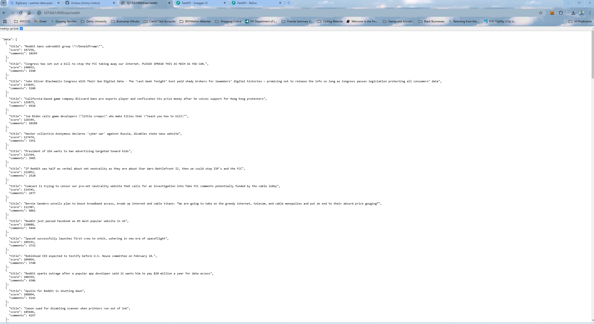
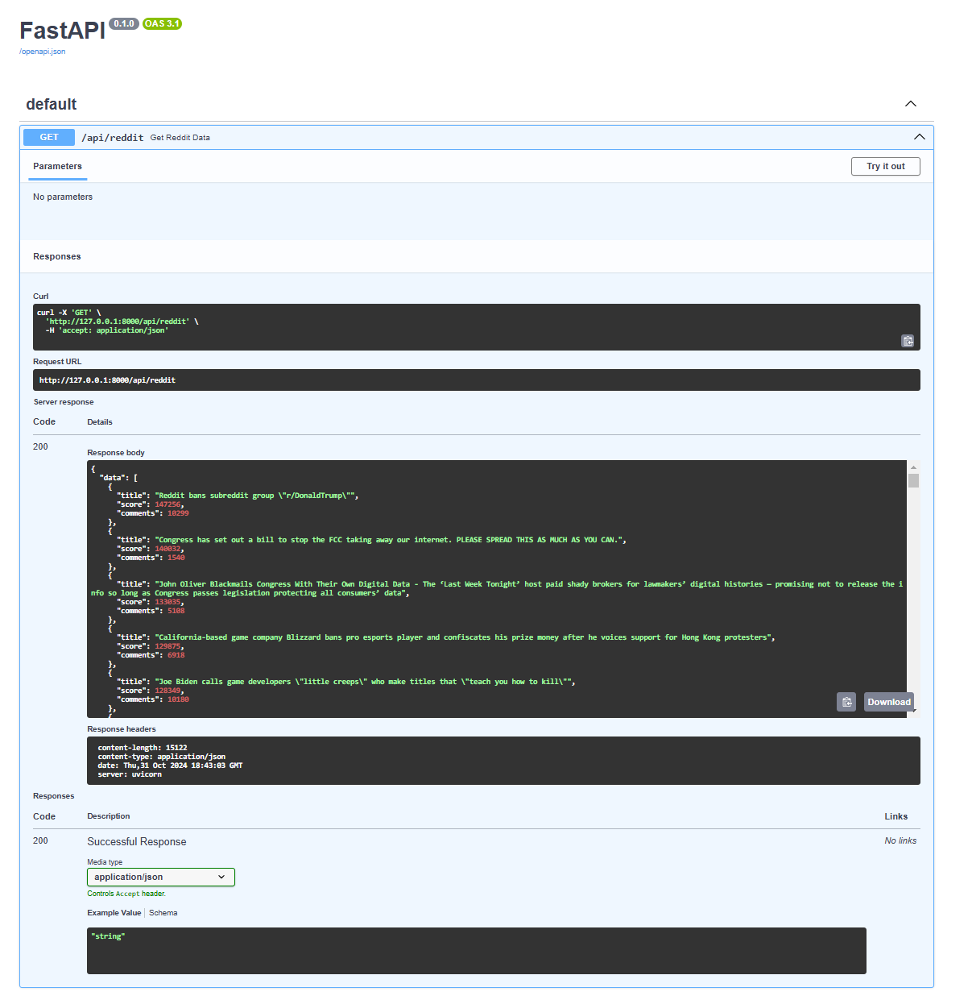
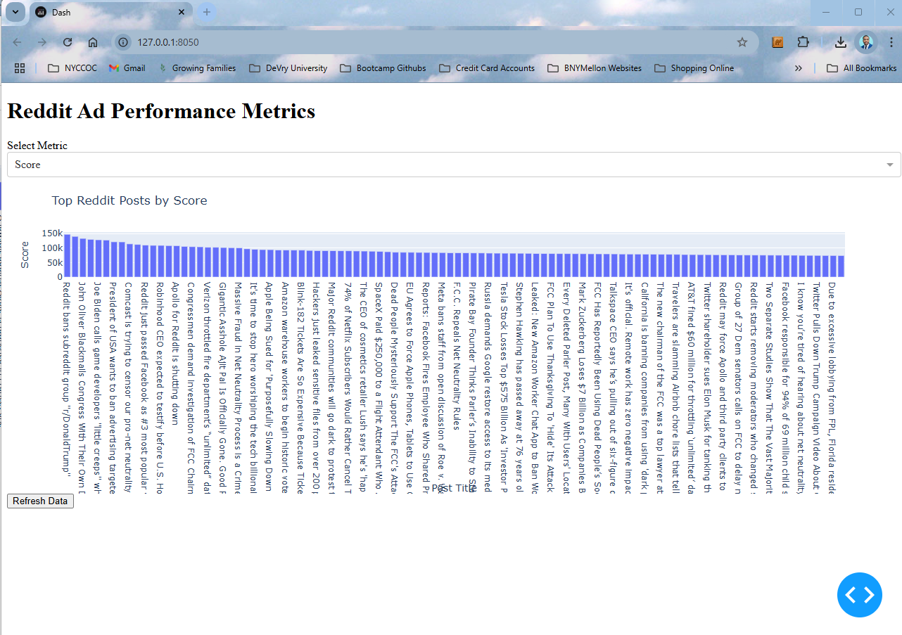

# Ad Analytics Pipeline for Social Media Campaigns

This project is a data pipeline for analyzing Reddit data as part of an Ad Analytics Pipeline for Social Media Campaigns (i.e Reddit). 
It leverages Google Cloud Platform (GCP) resources managed by Terraform and a FastAPI-based backend for data retrieval and visualization.

## Project Overview

The pipeline collects Reddit data, stores it in Google BigQuery, and provides an API endpoint to retrieve and visualize the data using FastAPI and Plotly Dash.

## Requirements

- **Python**: Install Python and set up a virtual environment.
- **Terraform**: Install Terraform and configure it to use Google Cloud.

## Setup Instructions

### Step 1: Configure Google Cloud Credentials
Ensure you have a GCP project and enable BigQuery and Cloud Storage APIs. Download the service account key JSON file and set the `GOOGLE_APPLICATION_CREDENTIALS` environment variable to its path.

### Step 2: Set up Terraform

1. Move to the project directory where `main.tf` is located.
2. Run the following commands:

    ```bash
    terraform init
    terraform apply
    ```

   Terraform will create:
   - A BigQuery dataset and table.
   - A Google Cloud Storage bucket.
   - IAM roles for BigQuery and Storage access.

### Step 3: Install Python Dependencies

Activate your virtual environment and install dependencies:

```bash
pip install -r requirements.txt
```

### Step 4: Run FastAPI

Start the FastAPI app to serve data through an API endpoint:

```bash
python api/app.py
```



### Step 5: Run the Dashboard

Start the Plotly Dash app for data visualization:

```bash
python app_dashboard.py
```


Visit `http://127.0.0.1:8000/docs` for the API documentation and `http://127.0.0.1:8050` for the dashboard.

## Project Files

- **main.tf**: Terraform configuration for setting up GCP resources.
- **app.py**: FastAPI backend serving Reddit data.
- **app_dashboard.py**: Plotly Dash application for visualizing Reddit data.
- **data_ingestion/fetch_data_reddit.py**: Script to fetch Reddit data and store it in Google Cloud Storage.
- **data_transformation/transform_data.py**: Script to load data from GCS to BigQuery.